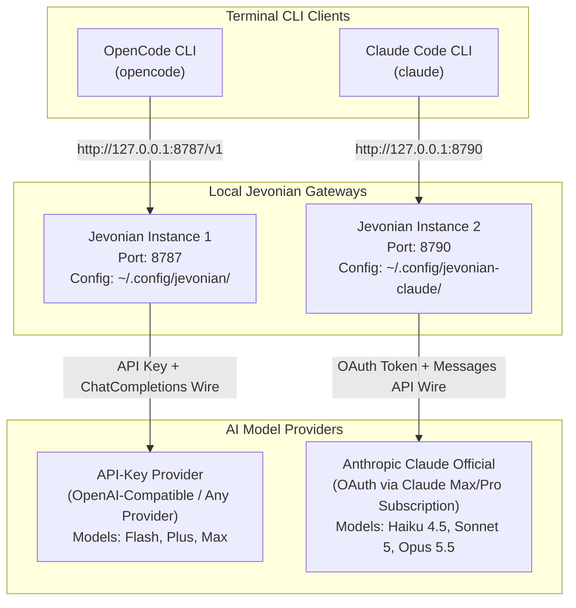

# Jevonian Dual-Agent Routing Setup Guide (OpenCode & Claude Code)

This guide documents the complete end-to-end architecture, installation, code patching, and configuration required to run **Jevonian** as a local intelligent model router for both **OpenCode** and **Claude Code** simultaneously.

---

## 1. System Architecture Overview



### Why Run Two Ports?
- **Port 8787 (OpenCode)**: Configured for API-key providers using Chat Completions wire protocol.
- **Port 8790 (Claude Code)**: Configured for Anthropic official Claude models using Messages API wire protocol with OAuth subscription authentication.
- **Isolation**: Each service maintains its own session stores, prompt caching statistics, cost ledger, and browser dashboard.

---

## 2. Step 1: Pulling, Building & Patching Jevonian from GitHub

### 2.1 Clone and Check Updates
Clone the official Jevonian repository from GitHub:
```powershell
git clone https://github.com/xinyao27/jevonian.git
cd jevonian
```

To update an existing installation to the latest upstream release:
```powershell
git fetch origin
git pull origin main
```

### 2.2 Install Dependencies
Jevonian uses `pnpm`:
```powershell
pnpm install
```

---

### 2.3 The 36-Line Compatibility Patch (`patch-jevonian.diff`)
Out-of-the-box Jevonian has two limitations when used with modern Claude Code CLI and custom effort levels:
1. **Explicit Tier Effort**: By default, Jevonian lets the router brain guess effort dynamically. If you want hardcoded per-tier efforts (e.g., `chat: low`, `execute: medium`, `plan: xhigh`), the schema needs an `effort` field in `RoutingEntry`.
2. **Claude Code CLI & Haiku 4.5 Compatibility**: Modern Claude Code CLI (v2.1.282+) sends `context_management`, `adaptive thinking`, and mid-conversation `role: "system"` messages. While `sonnet-5` and `opus-5-5` accept these, `haiku-4-5` returns `400 Bad Request`. The patch transparently cleans these fields when routing to Haiku.

Apply the included patch file:
```powershell
git apply patch-jevonian.diff
```

#### What the Patch Changes:
- **`src/config.ts` (8 lines)**: Adds `effort?: ReasoningEffort` to `RoutingEntry` interface and parses `routings[i].effort` from `config.json`.
- **`src/routing.ts` (11 lines)**: Uses the tier's configured effort (`tierEffort`) when defined instead of defaulting to brain guesses.
- **`src/upstream.ts` (22 lines)**: Enhances `applyClaudeCodeSystem()`:
  ```typescript
  const model = typeof next.model === "string" ? next.model.toLowerCase() : "";
  const support = anthropicThinkingSupport(model);

  if (!support.adaptive) {
    delete next.context_management;
    delete next.thinking;
    delete next.output_config;

    if (Array.isArray(next.messages)) {
      next.messages = next.messages.map((m: unknown) => {
        if (typeof m === "object" && m !== null && (m as Record<string, unknown>).role === "system") {
          return { ...(m as Record<string, unknown>), role: "user" };
        }
        return m;
      });
    }
  }
  ```

### 2.4 Compile the Project
Compile TypeScript into production artifacts:
```powershell
pnpm build
```
The compiled output is saved in `dist/cli.mjs` and `dist/web/`.

---

## 3. Step 2: OpenCode Configuration (Port 8787)

OpenCode is designed for general-purpose LLM providers using standard API keys.

### 3.1 Port Used
- **Gateway Port**: `8787` (`http://127.0.0.1:8787`)
- **Dashboard URL**: `http://127.0.0.1:8787/logs`

### 3.2 Jevonian Configuration (`~/.config/jevonian/config.json`)
Copy the template [config-opencode.json](file:///D:/learn/gemini-mcp/gemini-blogdee-subdomain/jevonian-multi-agent-deployment/config-opencode.json) to `C:\Users\<user>\.config\jevonian\config.json`:

```json
{
  "listen": {
    "host": "127.0.0.1",
    "port": 8787
  },
  "defaultProvider": "primary-provider",
  "providers": [
    {
      "name": "primary-provider",
      "type": "openai",
      "baseUrl": "https://your-api-endpoint.example.com/v1",
      "auth": "api-key",
      "apiKey": "YOUR_API_KEY_HERE",
      "models": [
        { "id": "deepseek-v4.1-flash" },
        { "id": "qwen3.8-flash" },
        { "id": "qwen3.7-plus" },
        { "id": "glm-5.3" },
        { "id": "qwen3.8-max" }
      ],
      "injectStreamUsage": true,
      "syncModels": false
    }
  ],
  "routing": {
    "mode": "auto",
    "routings": [
      {
        "id": "plan",
        "label": "Plan",
        "description": "High difficulty: architecture design, deep reasoning, system coordination",
        "models": ["glm-5.3", "qwen3.8-max"],
        "effort": "high"
      },
      {
        "id": "execute",
        "label": "Execute",
        "description": "Medium difficulty: code implementation, debugging, tool loops, refactoring",
        "models": ["qwen3.8-flash", "qwen3.7-plus"],
        "effort": "medium"
      },
      {
        "id": "utility",
        "label": "Background",
        "description": "Low difficulty: repository search, summarization, file indexing",
        "models": ["qwen3.7-plus", "qwen3.8-flash"],
        "effort": "low"
      },
      {
        "id": "chat",
        "label": "Chit-chat",
        "description": "Low difficulty: greetings, small talk, casual queries",
        "models": ["deepseek-v4.1-flash", "qwen3.8-flash"],
        "effort": "low"
      }
    ],
    "tiers": {
      "plan": ["glm-5.3", "qwen3.8-max"],
      "execute": ["qwen3.8-flash", "qwen3.7-plus"],
      "utility": ["qwen3.7-plus", "qwen3.8-flash"],
      "chat": ["deepseek-v4.1-flash", "qwen3.8-flash"]
    },
    "capacities": {
      "deepseek-v4.1-flash": { "efforts": ["low"] },
      "qwen3.8-flash": { "efforts": ["low", "medium"] },
      "qwen3.7-plus": { "efforts": ["low", "medium"] },
      "glm-5.3": { "efforts": ["high", "xhigh"] },
      "qwen3.8-max": { "efforts": ["high", "xhigh"] }
    },
    "sessionTtlMinutes": 720,
    "quotaGuard": {
      "enabled": true,
      "lowPercent": 10
    },
    "brains": [
      {
        "channel": "typesafe",
        "timeoutMs": 8000,
        "minConfidence": 0.6
      }
    ],
    "brainPicksEffort": false
  }
}
```

### 3.3 Task Difficulty & Model Mapping
- **`chat` (Low Effort)**: Fast flash models (e.g. `deepseek-v4.1-flash`) — optimal for greetings, small talk, and basic queries without tool calling.
- **`utility` (Low Effort)**: Plus-tier models (e.g. `qwen3.7-plus`) — fast background scans, file indexing, and session summaries.
- **`execute` (Medium Effort)**: Coding models (e.g. `qwen3.8-flash`, `qwen3.7-plus`) — code writing, test generation, and tool execution loops.
- **`plan` (High Effort)**: Frontier reasoning models (e.g. `glm-5.3`, `qwen3.8-max`) — multi-step task breakdowns, architectural plans, and code reviews.

### 3.4 OpenCode Client Configuration (`~/.config/opencode/opencode.json`)
Configure OpenCode to use the local Jevonian router:
```json
{
  "baseURL": "http://127.0.0.1:8787/v1",
  "model": "jevonian/auto"
}
```

### 3.5 Starting the OpenCode Gateway
You can launch the OpenCode gateway using either of the following:

```powershell
# Option A: Run the deployment runner script (Recommended)
node run-opencode.js
# Or double-click: run-opencode.bat

# Option B: Directly via Jevonian CLI
cd D:\learn\gemini-mcp\gemini-blogdee-subdomain\jevonian
node dist/cli.mjs serve
```

---

## 4. Step 3: Claude Code Configuration (Port 8790)

Claude Code connects to official Anthropic models using your Claude Max or Pro subscription via OAuth.

### 4.1 Port Used
- **Gateway Port**: `8790` (`http://127.0.0.1:8790`)
- **Dashboard URL**: `http://127.0.0.1:8790/logs`

### 4.2 Jevonian Configuration (`~/.config/jevonian-claude/config.json`)
Copy the template [config-claudecode.json](file:///D:/learn/gemini-mcp/gemini-blogdee-subdomain/jevonian-multi-agent-deployment/config-claudecode.json) to `C:\Users\<user>\.config\jevonian-claude\config.json`:

```json
{
  "listen": {
    "host": "127.0.0.1",
    "port": 8790
  },
  "defaultProvider": "claude-subscription",
  "providers": [
    {
      "name": "claude-subscription",
      "type": "anthropic",
      "baseUrl": "https://api.anthropic.com/v1",
      "auth": "oauth",
      "oauthSource": "claude-code",
      "billing": "subscription",
      "models": [
        { "id": "claude-haiku-4-5-20251001" },
        { "id": "claude-sonnet-5" },
        { "id": "claude-opus-5-5" }
      ],
      "injectStreamUsage": true,
      "headers": {
        "user-agent": "claude-cli/2.1.282 (external, cli)",
        "anthropic-beta": "context-management-2025-06-27,compact-2026-01-12"
      },
      "syncModels": false
    }
  ],
  "routing": {
    "mode": "auto",
    "routings": [
      {
        "id": "plan",
        "label": "Plan",
        "description": "High complexity reasoning & architectural blueprints (Claude Opus 5.5, xhigh effort)",
        "models": ["claude-opus-5-5"],
        "effort": "xhigh"
      },
      {
        "id": "execute",
        "label": "Execute",
        "description": "Implementation, bug fixing, tool loops (Claude Sonnet 5, medium effort)",
        "models": ["claude-sonnet-5"],
        "effort": "medium"
      },
      {
        "id": "utility",
        "label": "Background",
        "description": "Background repo scans, summaries, titles (Claude Sonnet 5, low effort)",
        "models": ["claude-sonnet-5"],
        "effort": "low"
      },
      {
        "id": "chat",
        "label": "Chit-chat",
        "description": "Greetings, casual conversation, quick queries (Claude Haiku 4.5, low effort)",
        "models": ["claude-haiku-4-5-20251001"],
        "effort": "low"
      }
    ],
    "tiers": {
      "plan": ["claude-opus-5-5"],
      "execute": ["claude-sonnet-5"],
      "utility": ["claude-sonnet-5"],
      "chat": ["claude-haiku-4-5-20251001"]
    },
    "capacities": {
      "claude-haiku-4-5-20251001": { "efforts": ["low"] },
      "claude-sonnet-5": { "efforts": ["low", "medium", "high"] },
      "claude-opus-5-5": { "efforts": ["high", "xhigh"] }
    },
    "sessionTtlMinutes": 720,
    "quotaGuard": {
      "enabled": true,
      "lowPercent": 10
    },
    "brains": [
      {
        "channel": "typesafe",
        "timeoutMs": 8000,
        "minConfidence": 0.6
      }
    ],
    "brainPicksEffort": false
  }
}
```

### 4.3 Claude Code Task & Effort Breakdown
- **`chat` (Low Effort)**: **`claude-haiku-4-5-20251001`** ($1 / $5 per MTok). Ultra-fast conversational interactions.
- **`utility` (Low Effort)**: **`claude-sonnet-5`** ($2 / $10 per MTok). Background repo context reading, summaries, and title generation.
- **`execute` (Medium Effort)**: **`claude-sonnet-5`** ($2 / $10 per MTok). Code editing, bug debugging, test execution, and bash tool calls.
- **`plan` (XHigh Effort)**: **`claude-opus-5-5`** ($4 / $20 per MTok). Deepest frontier intelligence for multi-region system design and architectural blueprints.

### 4.4 Claude Code Client Configuration (`~/.claude/settings.json`)
Configure Claude Code to send all traffic to port 8790:
```json
{
  "env": {
    "ANTHROPIC_BASE_URL": "http://127.0.0.1:8790",
    "ANTHROPIC_AUTH_TOKEN": "jevonian-local",
    "ANTHROPIC_API_KEY": "",
    "ANTHROPIC_DEFAULT_OPUS_MODEL": "jevonian/auto",
    "ANTHROPIC_DEFAULT_SONNET_MODEL": "jevonian/auto",
    "ANTHROPIC_DEFAULT_HAIKU_MODEL": "jevonian/utility",
    "CLAUDE_CODE_SUBAGENT_MODEL": "jevonian/auto"
  }
}
```

### 4.5 Starting the Claude Code Gateway
Run the launcher script [run-claude.js](file:///D:/learn/gemini-mcp/gemini-blogdee-subdomain/jevonian-multi-agent-deployment/run-claude.js) or double-click the batch file:

```powershell
node run-claude.js
# Or double-click: run-claude.bat
```

---

## 5. Step 4: Verification & Live Health Checks

### 5.1 Automated All-in-One Verification Script
Run the automated verification script [test-verify.js](file:///D:/learn/gemini-mcp/gemini-blogdee-subdomain/jevonian-multi-agent-deployment/test-verify.js) to probe both gateways and test the OpenCode tool wire normalizer:

```powershell
node test-verify.js
```

### 5.2 Manual Endpoint Checks
Verify both servers individually via curl or PowerShell:

```powershell
# OpenCode (Port 8787)
curl http://127.0.0.1:8787/v1/models

# Claude Code (Port 8790)
curl http://127.0.0.1:8790/v1/models
```

Expected response on both:
```json
{
  "object": "list",
  "data": [
    { "id": "jevonian/auto" },
    { "id": "jevonian/plan" },
    { "id": "jevonian/execute" },
    { "id": "jevonian/utility" },
    { "id": "jevonian/chat" }
  ]
}
```

### 5.2 Real Verification Runs
Execute test turns from terminal:

```powershell
# Test 1: Chat Routing (Triggers Haiku 4.5 on Port 8790)
claude -p "Hello! Who are you?" --dangerously-skip-permissions

# Test 2: Coding Routing (Triggers Sonnet 5 on Port 8790)
claude -p "Write an IPv4 validator function in TypeScript." --dangerously-skip-permissions

# Test 3: Plan Routing (Triggers Opus 5.5 on Port 8790)
claude -p "Design an architectural blueprint for a zero-downtime database migration." --dangerously-skip-permissions
```

### 5.3 Live Dashboards
Inspect the live routing decisions, token usage, and latency in your browser:
- OpenCode: [http://127.0.0.1:8787/logs](http://127.0.0.1:8787/logs)
- Claude Code: [http://127.0.0.1:8790/logs](http://127.0.0.1:8790/logs)

---

## 6. Troubleshooting: OpenCode & Strict OpenAI-Compatible Providers

### Error: `if content is list. item must be dict and key[type] should in dict`
- **Cause**: OpenCode stores multi-turn conversation histories with Anthropic-style blocks (`type: "tool_use"` and `type: "tool_result"`). When talking to an OpenAI-compatible endpoint (`/v1/chat/completions`), OpenCode's `@ai-sdk/openai-compatible` client leaves these blocks inside the `message.content` array. Strict Python validators on upstreams like Alibaba Cloud Model Studio reject this because OpenAI-wire `content` arrays may only contain `{ type: "text" }` or `{ type: "image_url" }`.
- **Solution**: Jevonian includes a built-in normalizer (`normalizeOpenAIMessages` in `src/wire.ts`) applied before egress in `src/upstream.ts`. It automatically converts:
  1. `type: "tool_use"` inside assistant content into standard OpenAI `tool_calls`.
  2. `type: "tool_result"` inside user content into separate OpenAI `role: "tool"` messages.
  3. Text array blocks into merged strings so strict schemas are 100% compliant.

> [!NOTE]
> For the complete technical post-mortem, anatomy of the error, and reproduction evidence, see [OPENCODE_ISSUE_POSTMORTEM.md](file:///D:/learn/gemini-mcp/gemini-blogdee-subdomain/jevonian-multi-agent-deployment/OPENCODE_ISSUE_POSTMORTEM.md).

---

## 7. OpenCode Auto-Compaction & Multimodal Optimization (`prune: true`)

### Error: `Download multimodal file timed out`
- **Cause**: During UI automation (e.g., Android `android_Snapshot`), OpenCode captures screenshots and stores them as inline base64 Data URIs (`data:image/png;base64,...`) in the chat history. By default, OpenCode has **`compaction.prune: false`**, which causes **all previous screenshots to be re-transmitted on every single turn**. After multiple snapshot operations, the payload balloons to 200,000+ tokens and tens of megabytes, causing upstream multimodal gateways (such as Alibaba Cloud Model Studio) to hit a 60+ second timeout.
- **Solution**: Configure OpenCode's official V2 compaction settings in `opencode.json`:
  ```json
  {
    "$schema": "https://opencode.ai/config.json",
    "compaction": {
      "auto": true,
      "prune": true,
      "reserved": 10000
    }
  }
  ```
  - **`prune: true`**: Automatically removes historical tool outputs (such as old screenshots) once they are superseded, preventing base64 bloat.
  - **`auto: true`**: Performs automatic compaction before dispatching requests when context grows.
  - **`reserved: 10000`**: Preserves a 10k token safety buffer to avoid context overflow.

### In-Session Quick Recovery
If an ongoing OpenCode session hits a context bloat or timeout error, type:
```text
/compact
```
This forces an immediate summarization and wipes stale base64 images from active memory without losing conversation context.

---

## 8. Multi-Client Matrix: Kilo CLI & Ref MCP Integration

### 8.1 Kilo CLI vs OpenCode
Both Kilo CLI and OpenCode can be routed through Jevonian on port 8787:

| Client | Configuration File | Image Handling | Compaction Model |
|---|---|---|---|
| **OpenCode** | `opencode.json` | Inlines base64 into history | Enabled via `"compaction": { "prune": true }` |
| **Kilo CLI** | `kilo.json` | Stores tool results cleanly | Native lightweight history model |

To run Kilo CLI through Jevonian:
```powershell
# Interactive TUI mode
kilo

# One-shot command
kilo run "analyze repository structure"

# Explicit tier pinning
kilo -m jevonian/plan
```

### 8.2 Ref MCP Integration (Technical Documentation Search)
The Ref MCP server (`ref-tools-mcp`) provides fast, token-efficient technical documentation searches for APIs, frameworks, and tools.

1. **System Environment Registration:**
   ```powershell
   setx REF_API_KEY "YOUR_REF_API_KEY"
   ```
2. **Client Manifest Configuration (`opencode.json` / `kilo.json`):**
   ```json
   "mcp": {
     "ref": {
       "type": "local",
       "command": ["npx", "-y", "ref-tools-mcp"],
       "environment": {
         "REF_API_KEY": "YOUR_REF_API_KEY"
       },
       "enabled": true,
       "timeout": 30000
     }
   }
   ```
   Both OpenCode and Kilo CLI can now call `ref_search_documentation` and `ref_read_url` dynamically to query live upstream documentation without polluting context windows.


